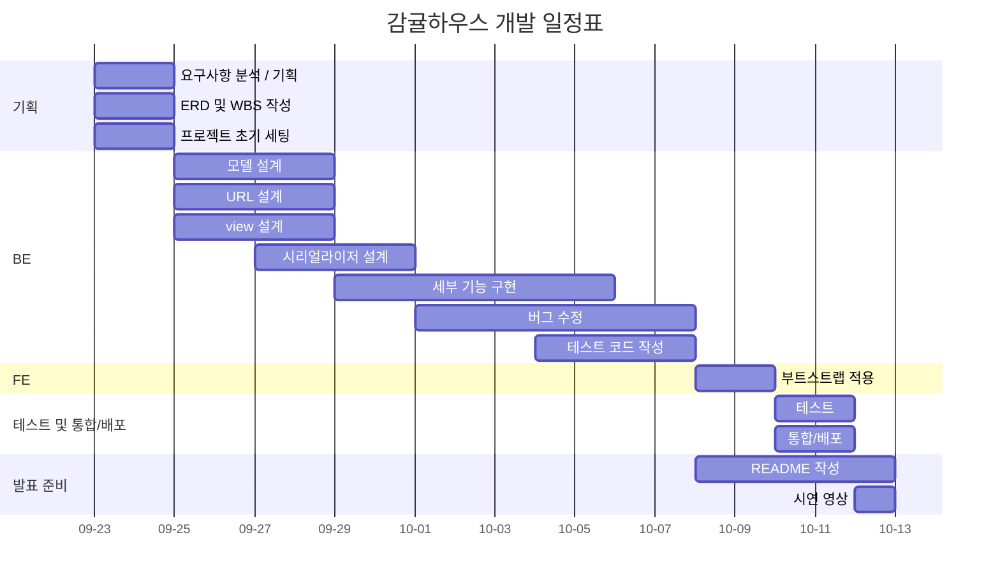
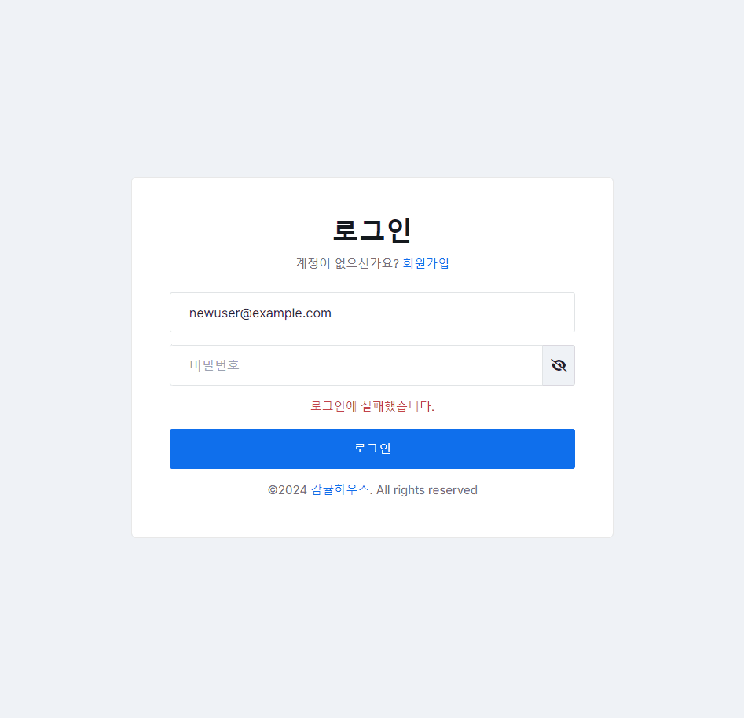
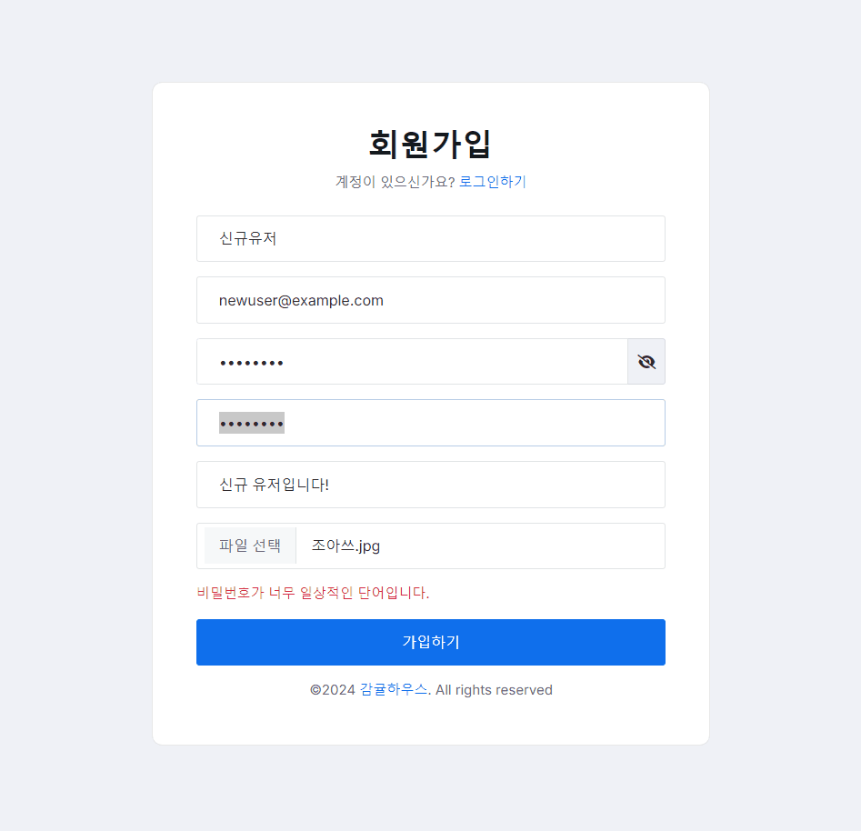
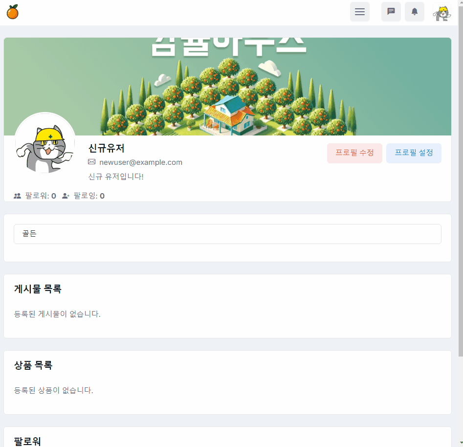
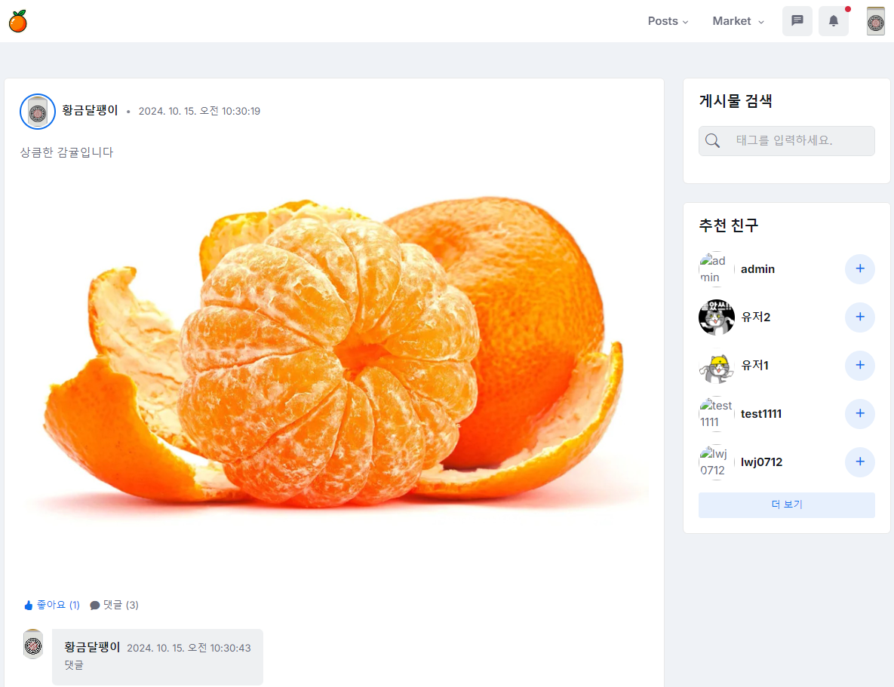
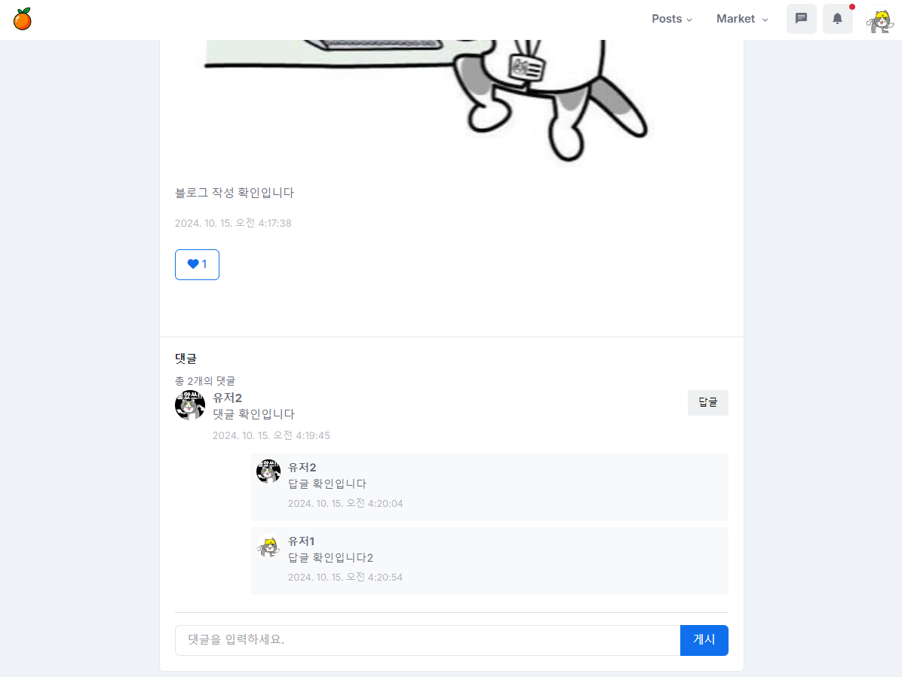
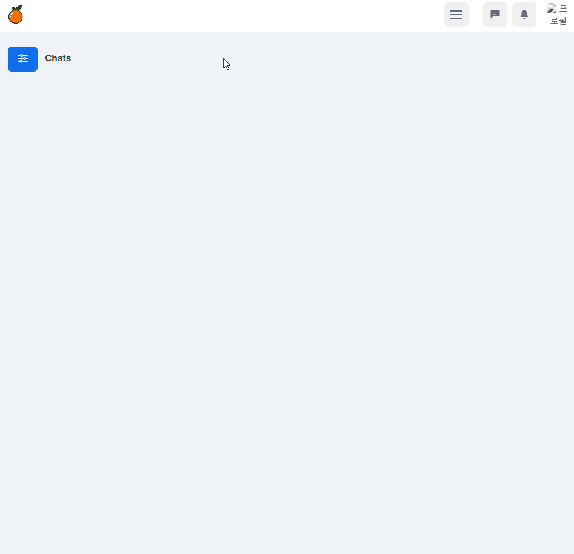
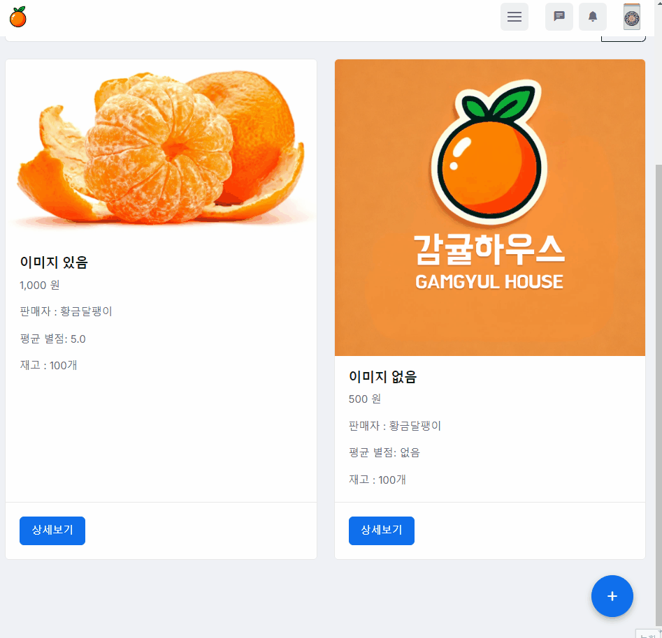

# 🍊 감귤하우스 


<br>

## 프로젝트 개요

프로젝트 명 : Gamgyul House <br>
프로젝트 진행 기간 : 24.09.20 ~ 24.10.14

- 감귤하우스는 상품을 홍보하고 거래할 수 있는 SNS 플랫폼입니다. 
- 상품을 등록하지 않아도 일상을 공유하며 SNS 활동을 할 수 있습니다. 
- 사진과 함께 게시물을 작성하여 자신의 일상을 공유할 수 있습니다.
- 다른 사용자를 팔로우하면 유저가 올린 게시물을 홈 피드에서 확인할 수 있습니다.
- 다른 사용자와 메시지를 주고 받을 수 있습니다.
- 피드를 구경하다가 마음에 드는 게시물을 발견했다면 좋아요와 댓글을 남길 수 있습니다.

<br>

## 🏡 1. 팀 소개

| 이름   | 사진  | 깃허브 주소               | 담당 파트            |
|--------|-------|----------------------------|----------------------|
| 김동규  |  | [@Donggyu-Kim](https://github.com/Donggyu-Kim1) | accounts, report, FE, 배포 |
| 이원재  |  | [@lwz7](https://github.com/lwj0712) | chat, alarm, README 작성, 배포 |
| 문지영  |  | [@JiyoungMoon](https://github.com/whaehofk521) | insta, FE |
| 박성재  |  | [@HwangDal85](https://github.com/HwangDal85) | market, FE |

<br>

## 2. 개발 목표

저희 감귤하우스 팀은 현대적이고 확장 가능한 SNS 및 사용자 간 직거래 플랫폼을 개발하는 것을 목표로 하고 있습니다. 주요 개발 목표는 다음과 같습니다.

1. **Django Rest Framework(DRF)** 를 활용한 `RESTful API` 구현
   - 효율적이고 확장 가능한 백엔드 설계
   - API 버전 관리 및 문서화

2. **WebSocket** 을 이용한 실시간 통신 구현
   - 채팅 기능 및 실시간 알림 시스템 개발
   - 효율적인 서버-클라이언트 통신 구조 설계

3. **사용자 인증 시스템** 구축
   - 안전하고 확장 가능한 사용자 인증 메커니즘 개발
   - 토큰 기반 인증과 세션 기반 인증의 장단점 이해

4. **Class-Based Views(CBV)** 를 통한 CRUD 기능 구현
   - 재사용 가능하고 유지보수가 용이한 `view` 로직 설계
   - DRF의 `generic views` 활용 숙달

5. **팀 협업 경험 축적**
   - `Git`을 활용한 버전, 브랜치 관리 및 협업 워크플로우 확립
   - 팀원끼리 부담없이 물어보고 도와주는 협업 문화 형성

6. **AWS** 를 통한 클라우드 배포
   - 클라우드 인프라 구축 및 관리 경험 습득
   - CI/CD 파이프라인 구축을 통한 자동화된 배포 프로세스 확립

7. **Docker** 를 활용한 일관된 개발 및 운영 환경 구축
   - 컨테이너화된 애플리케이션 개발 및 배포 프로세스 학습

8. **Redis** 를 통한 효율적인 메모리 관리 및 실시간 기능 구현
   - 실시간 데이터 처리 최적화
   - 채팅 기능을 위한 메시지 브로커로 `Redis` 활용
   - 사용자 접속 상태 관리 및 실시간 알림 기능 구현
  
9. **Daphne**를 활용한 ASGI 서버 구현
   - `Django Channels`와 `Daphne`를 이용한 `WebSocket` 연결 관리
   - 비동기 처리를 통한 고성능 실시간 통신 구현

10. 확장 가능한 **데이터베이스** 설계
   - 복잡한 관계를 가진 데이터 모델 설계 및 구현

<br>

이 프로젝트를 통해 저희 팀은 현대적인 웹 개발 기술 스택을 종합적으로 활용하며, 실무에서 발생할 수 있는 다양한 기술적 도전과제를 해결하는 경험을 쌓을 것입니다. 이를 통해 팀원 각자의 기술적 역량을 향상시키는 동시에, 효과적인 의사소통, 작업 분배, 코드 리뷰 등 개발 과정에서 발생하는 팀원 간의 상호작용을 원활히 관리하고 조율하는 능력도 함께 키우고자 합니다.

<br>

## 3. 기능 명세

#### 🔑 1. 사용자 관리 (accounts 앱)

1.1. 인증 및 권한 관리
- 회원가입, 로그인, 로그아웃
- 세션 기반 인증: Django 세션 기반 인증을 사용하며, 로그인한 사용자는 세션을 통해 인증 상태가 유지됩니다.
- 소셜 로그인 : Google 계정으로 소셜 로그인을 지원합니다. JWT 인증을 사용합니다.
- 사용자 권한 : 로그인한 사용자만 특정 기능(채팅, 알림, 게시글 작성 등)을 사용할 수 있습니다.

1.2. 프로필 관리
- 프로필 정보 수정: 사용자는 자신의 프로필 사진, 자기소개 등의 정보를 수정할 수 있습니다.
- 프로필 설정 : 사용자는 자신의 정보 허용 범주를 나를 팔로우하는 사용자, 내가 팔로우하는 사용자, 기타 사용자에 대해 세분화하여 설정할 수 있습니다.
- 다른 사용자 프로필 보기: 사용자는 다른 사용자의 프로필을 볼 수 있습니다.
- 팔로우/언팔로우 기능: 사용자는 다른 사용자를 팔로우/언팔로우 할 수 있으며, 팔로우한 사용자의 활동이 피드에 나타납니다.
- 계정 비활성화 기능 : 계정을 비활성화 할 수 있습니다. 이메일 인증 절차를 거치면 다시 활성화할 수 있습니다.
- 계정 삭제 기능 : 사용자는 자신의 계정을 영구히 삭제할 수 있습니다.

1.3. 비밀번호 관리
- 비밀번호 변경: 사용자는 자신의 비밀번호를 변경할 수 있습니다.

1.4. 사용자 활동 기록
- 마켓 활동 기록: 사용자는 자신이 마켓에 등록한 상품을 확인 할 수 있습니다.

1.5 사용자 추천 기능
- 사용자가 팔로우 하는 사람들이 팔로우하는 사용자, 사용자가 작성한 게시글에 달린 태그와 동일한 태그를 사용한 다른 사용자, 팔로워가 가장 많은 사용자 1위부터 3위를 종합하여 총 15명의 사용자가 추천 목록에 나타납니다.

#### 📢 2. 실시간 알림 기능 (alarm 앱)

2.1. 알림 생성
- 사용자는 새로운 메시지, 팔로우, 댓글 등의 중요한 이벤트가 발생할 때 실시간 알림을 받습니다. 이 알림은 `Django Channels`와 `WebSocket`을 통해 실시간으로 전달됩니다.

2.2 메시지 알림
- 새로운 메시지가 생성되면 알림을 생성합니다. 메시지 수신자가 WebSocket 연결 중인 상태(메시지가 생성된 채팅방에 접속해 있는 상태)라면 알림을 생성하지 않습니다.

2.3. 알림 클릭 시 리디렉션
- 알림을 클릭하면 관련된 페이지(예: 댓글이 달린 게시물)로 리디렉션 됩니다.

2.4. 알림 삭제 및 관리
- 사용자는 알림을 개별 또는 일괄 삭제할 수 있습니다.


#### 🤝 3. 실시간 채팅 기능 (chat 앱)

3.1. 1대1 실시간 채팅
- 사용자는 다른 사용자와 1대 1로 실시간 채팅을 할 수 있으며, 메시지는 WebSocket을 통해 실시간으로 전송됩니다.

3.2 이미지 첨부 기능
- 사용자는 이미지를 첨부하여 메시지로 전송할 수 있습니다. 5MB 이하로 제한됩니다.

3.2. 채팅 기록 저장 및 조회
- 이전에 주고받은 메시지들은 저장됩니다. 사용자는 채팅방에 다시 들어왔을 때 이전 채팅 기록을 조회할 수 있습니다.

3.3. 채팅방 생성 및 관리
- 사용자는 다른 사용자와의 대화를 시작할 때 새로운 채팅방을 생성하며, 채팅방 목록을 관리할 수 있습니다. 사용자가 채팅방에서 나가면 해당 채팅방이 목록에서 제거됩니다. 사용자가 모두 채팅방에서 나가면 채팅방이 제거됩니다.

3.4. 대화 읽음 처리 기능
- 채팅방에 입장하는 순간 채팅방의 모든 대화를 읽음 처리합니다. 이를 통해 쌓여있던 메시지들을 한 번에 읽음 처리합니다.
- 사용자의 WebSocket 연결 종료 시간을 기록합니다. 만약 메시지 수신자가 WebSocket 연결 중인 상태라면 실시간으로 메시지를 읽음 처리합니다.

#### 📷 4. 게시글 관리 (insta 앱)

4.1. 사진 기반 게시물 작성
- 사용자는 사진과 텍스트가 포함된 게시물을 작성할 수 있습니다. 게시물은 제목 필드가 없으며, 이미지 중심의 SNS입니다.

4.2 피드 기능
- 내가 팔로우 중인 사용자의 게시글이 피드에 나타납니다. 팔로우하는 사용자가 없다면 팔로워가 많은 사용자 1위 부터 10위까지의 게시글이 피드에 나타납니다.

4.3. 게시물 조회 및 태그
- 사용자는 게시물에 달린 태그를 통해 검색하거나 조회할 수 있습니다.

4.4. 게시물에 대한 댓글 및 좋아요
- 사용자는 게시물에 댓글을 달거나 좋아요를 남길 수 있습니다.

#### 🛒 5. 사용자 간 직거래 기능 (market 앱)

5.1. 상품(감귤) 게시 및 거래
- 사용자는 상품 이름, 가격, 상품 설명, 재고, 품종, 재배지역, 재배일자, 이미지를 포함하여 상품을 게시할 수 있습니다. 결제 기능을 포함하지 않으며, 사용자가 서로 협의하여 직접 거래하는 방식입니다.

5.2 상품 리뷰 기능
- 상품 게시물에 대한 리뷰를 작성할 수 있습니다. 별점을 줄 수 있으며, 별점의 평균 값이 상품 페이지에 나타납니다.

5.2. 상품 검색 및 조회
- 사용자는 거래할 상품을 검색하고 게시된 상품의 세부 정보를 확인할 수 있습니다. 상품은 키워드로 검색할 수 있습니다.

#### 🚨 6. 신고 기능 (report 앱)

6.1. 게시물, 상품
- 사용자는 부적절하거나 불법적인 게시물이나 상품을 신고할 수 있습니다. 신고자는 신고 사유를 작성하여 전송합니다.

6.2. 신고 내용 관리
- 신고된 내용은 관리자 페이지에서 관리되며, 관리자가 신고 사유를 확인하고 적절한 조치를 취할 수 있습니다.

6.3 신고 처리 상태 관리
- 신고된 내용은 관리자 페이지에서 (처리 대기, 처리 중, 해결됨, 반려됨) 처리 상태를 관리할 수 있습니다.

<br>

## 4. 기술 스택

### 4.1 기술 스택
<div align=left>
   
  <br>
  
   
   
   
  <br>
  
   
  
  <br>

  
  
  
  <br>

   
   
  <br>
  
  
  
</div>

<br>

## 5. 개발 환경 및 배포 URL

### 5.1 개발 환경

- Tools:

    
    

- Web Framework:

    
    
    

- 배포 환경:

    
    
    


- 협업 툴:

    
    
    
    

### 5.2 배포 URL

URL: http://3.36.50.126/admin/

```markdown
[관리자 유저]

id: admin
pw: 1234
```

<br>

## 6. API 문서 및 URL 구조

### 6.1 API 문서

- Swagger URL : http://3.36.50.126/api/schema/swagger-ui/
- Redoc URl : http://3.36.50.126/api/schema/redoc/

<br>

### 6.2 URL 구조

#### 🔑 accounts

| app: accounts | HTTP Method | 설명 | 로그인 권한 필요 | 작성자 권한 필요 | 추가 권한 |
| :-- | --- | --- | :-: | :-: | --- |
| signup/ | POST | 회원가입 |  |  |  |
| login/ | POST | 로그인 |  |  |  |
| logout/ | POST | 로그아웃 | ✅ |  |  |
| change-password/ | PUT | 비밀번호 변경 | ✅ | ✅ |  |
| deactivate/ | POST | 계정 비활성화 | ✅ | ✅ |  |
| delete/ | POST | 계정 삭제 | ✅ | ✅ |  |
| request-reactivation/ | POST | 계정 재활성화 요청 |  |  |  |
| activate/\<uidb64\>/\<token\>/ | GET | 계정 활성화 |  |  | 유효한 토큰 |
| profile/\<str:username\>/ | GET | 유저 프로필 조회 | ✅ |  |  |
| profile/ | PUT, PATCH | 유저 프로필 수정 | ✅ | ✅ |  |
| privacy-settings/ | GET, PUT, PATCH | 개인정보 설정 조회 | ✅ | ✅ |  |
| follow/\<int:pk\>/ | POST | 사용자 팔로우 | ✅ |  |  |
| unfollow/\<int:pk\>/ | DELETE | 사용자 언팔로우 | ✅ |  |  |
| search/ | GET | 유저 프로필 검색 | ✅ |  |  |
| recommend/ | GET | 친구 추천 | ✅ |  |  |

#### 📢 alarm

| app: alarm | HTTP Method | 설명 | 로그인 권한 필요 | 작성자 권한 필요 | 추가 권한 |
| :-- | --- | --- | :-: | :-: | --- |
| alarms/ | GET | 현재 로그인한 사용자의 알림 목록 조회 | ✅ |  |  |
| alarms/\<int:alarm_id\>/ | DELETE | 특정 알림 삭제 | ✅ |  | 해당 알림의 수신자여야 함 |
| alarms/bulk-delete/ | DELETE | 모든 알림 삭제 | ✅ |  | 해당 알림의 수신자여야 함 |

#### 🤝 chat

| app: chat | HTTP Method | 설명 | 로그인 권한 필요 | 작성자 권한 필요 | 추가 권한 |
| :-- | --- | --- | :-: | :-: | --- |
| / | GET | 현재 사용자가 속한 채팅방 목록 조회 | ✅ |  |  |
| /create/ | POST | 1대1 채팅방 생성 | ✅ |  |  |
| /\<uuid:room_id\>/ | GET | 특정 채팅방 정보 조회 | ✅ |  | 해당 채팅방 참여자여야 함 |
| /\<uuid:room_id\>/leave/ | DELETE | 채팅방 나가기 | ✅ |  | 해당 채팅방 참여자여야 함 |
| /\<uuid:room_id\>/messages/ | GET | 채팅방 내 메시지 목록 조회 | ✅ |  | 해당 채팅방 참여자여야 함 |
| /\<uuid:room_id\>/messages/send/ | POST | 메시지 생성 | ✅ |  | 해당 채팅방 참여자여야 함 |
| /\<uuid:room_id\>/messages/search/ | GET | 메시지 검색 | ✅ |  | 해당 채팅방 참여자여야 함 |

#### 📷 insta

| app: insta | HTTP Method | 설명 | 로그인 권한 필요 | 작성자 권한 필요 | 추가 권한 |
| :-- | --- | --- | :-: | :-: | --- |
| /posts/ | GET | 게시글 목록 조회 |  |  |  |
| /posts/\<int:pk\>/ | GET | 게시글 상세 조회 |  |  |  |
| /posts/\<int:pk\>/ | PATCH | 게시글 수정 | ✅ | ✅ |  |
| /posts/create/ | POST | 게시글 작성 | ✅ |  |  |
| /posts/\<int:pk\>/delete/ | DELETE | 게시글 삭제 | ✅ | ✅ |  |
| /posts/\<int:post_id\>/comments/ | GET, POST | 게시글에 댓글 목록 조회 및 댓글 작성 | ✅ |  |  |
| /posts/<int:post_id>/comments/<int:comment_id>/ | GET, PATCH, DELETE | 댓글 상세 조회, 수정, 삭제 | ✅ | ✅ |  |
| /posts/\<int:post_id\>/like/ | POST, DELETE | 게시글 좋아요, 좋아요 취소 | ✅ | ✅ |  |
| /posts/search/ | GET | 태그로 게시글 검색 |  |  |  |

#### 🛒 market

| app: market | HTTP Method | 설명 | 로그인 권한 필요 | 작성자 권한 필요 | 추가 권한 |
| :-- | --- | --- | :-: | :-: | --- |
| /products/ | GET | 상품 목록 조회 |  |  |  |
| /products/create/ | POST | 상품 생성 | ✅ |  |  |
| /products/\<int:id\>/ | GET | 상품 상세 조회 |  |  |  |
| /products/\<int:id\>/update/ | PATCH | 상품 정보 수정 | ✅ | ✅ |  |
| /products/\<int:id\>/delete/ | DELETE | 상품 삭제 | ✅ | ✅ |  |
| /products/\<int:product_id\>/reviews/\<int:id\>/delete/ | DELETE | 상품 리뷰 삭제 | ✅ | ✅ |  |

#### 🚨 report

| app: report | HTTP Method | 설명 | 로그인 권한 필요 | 작성자 권한 필요 | 추가 권한 |
| :-- | --- | --- | :-: | :-: | --- |
| /create/ | POST | 신고 생성 | ✅ |  |  |

<br>

## 7. 프로젝트 구조와 개발 일정

### 7.1 프로젝트 구조

```
📦BE
 ┣ 📂accounts
 ┃ ┣ 📂migrations
 ┃ ┣ 📂tests
 ┃ ┃ ┣ 📜test_views_account.py
 ┃ ┃ ┣ 📜test_views_profile.py
 ┃ ┃ ┗ 📜test_views_recommendation.py
 ┃ ┣ 📂views
 ┃ ┃ ┣ 📜account.py
 ┃ ┃ ┣ 📜profile.py
 ┃ ┃ ┗ 📜recommendation.py 
 ┃ ┣ 📜admin.py
 ┃ ┣ 📜apps.py
 ┃ ┣ 📜auth_backends.py     # 계정 비활성화 기능 구현을 위한 custom 인증 함수
 ┃ ┣ 📜filters.py           # 검색, 친구 추천기능 구현
 ┃ ┣ 📜models.py
 ┃ ┣ 📜serializers.py
 ┃ ┗ 📜urls.py
 ┣ 📂alarm                  # 실시간 알람 생성을 위해 WebSocket 연결 사용
 ┃ ┣ 📂migrations
 ┃ ┣ 📜admin.py
 ┃ ┣ 📜apps.py
 ┃ ┣ 📜comsumers.py
 ┃ ┣ 📜models.py
 ┃ ┣ 📜routing.py           # 특정 URL에 대한 WebSocket 연결
 ┃ ┣ 📜serializers.py
 ┃ ┣ 📜signals.py           # 특정 이벤트가 발생할 때 특정 동작을 수행하게 설정  
 ┃ ┣ 📜tests.py
 ┃ ┣ 📜urls.py
 ┃ ┣ 📜views.py
 ┣ 📂chat                   # 실시간 채팅 구현을 위해 WebSocket 연결 사용
 ┃ ┣ 📂migrations
 ┃ ┣ 📜admin.py
 ┃ ┣ 📜apps.py
 ┃ ┣ 📜comsumers.py
 ┃ ┣ 📜models.py
 ┃ ┣ 📜routing.py           # 특정 URL에 대한 WebSocket 연결          
 ┃ ┣ 📜serializers.py
 ┃ ┣ 📜tests.py
 ┃ ┣ 📜urls.py
 ┃ ┣ 📜views.py
 ┣ 📂config
 ┃ ┣ 📜asgi.py              # 비동기 요청을 처리
 ┃ ┣ 📜pagination.py        # 공통으로 사용되는 pagination
 ┃ ┣ 📜settings.py
 ┃ ┣ 📜urls.py
 ┃ ┗ 📜wsgi.py
 ┣ 📂insta
 ┃ ┣ 📂migrations
 ┃ ┣ 📜admin.py
 ┃ ┣ 📜apps.py
 ┃ ┣ 📜filters.py
 ┃ ┣ 📜models.py
 ┃ ┣ 📜serializers.py
 ┃ ┣ 📜tests.py
 ┃ ┣ 📜urls.py
 ┃ ┗ 📜views.py
 ┣ 📂market
 ┃ ┣ 📂migrations
 ┃ ┣ 📜admin.py
 ┃ ┣ 📜apps.py
 ┃ ┣ 📜models.py
 ┃ ┣ 📜serializers.py
 ┃ ┣ 📜tests.py
 ┃ ┣ 📜urls.py
 ┃ ┗ 📜views.py
 ┣ 📂report
 ┃ ┣ 📂migrations
 ┃ ┣ 📜admin.py
 ┃ ┣ 📜apps.py
 ┃ ┣ 📜models.py
 ┃ ┣ 📜serializers.py
 ┃ ┣ 📜tests.py
 ┃ ┣ 📜urls.py
 ┃ ┗ 📜views.py
 ┣ 📜.gitignore
 ┣ 📜README.md
 ┣ 📜docker-compose.yml
 ┣ 📜manage.py
 ┗ 📜requirements.txt
```
</details>

<br>

### 7.2 개발 일정



<br>

## 8. ERD


<h4>관계도 해설</h4>

1. 사용자 관리:
    - `User` 테이블이 중심이 되어 사용자의 기본 정보를 저장합니다.
    - `SocialAccount` 테이블은 소셜 로그인 기능을 지원합니다.
    - `PrivacySettings` 테이블로 사용자의 개인정보 공개 설정을 관리합니다.
    - `Follow` 테이블로 사용자 간의 팔로우 관계를 표현합니다.

2. SNS 기능:
    - `Post`, `Comment`, `Like` 테이블들로 게시물, 댓글, 좋아요 기능을 구현합니다.
    - `PostImage` 테이블은 게시물에 여러 이미지를 첨부할 수 있게 합니다.

3. 메시지 시스템:
    - `ChatRoom`, `Message` 테이블은 사용자 간 채팅 기능을 제공합니다.
    - `WebSocketConnection` 테이블은 실시간 통신을 관리합니다.
        - 현재 사용자가 채팅방에 연결되어 있는지를 확인할 수 있습니다.
        - 채팅방에 연결되어 있는 상태라면 새로운 메시지를 읽음 처리합니다.
        - 채팅방에 연결되어 있는 상태라면 메시지 알림을 보내지 않습니다.

4. 알림 시스템:
    - 새로운 메시지에 대한 알림을 생성합니다.
    - 다른 사용자가 나를 팔로우 했을 때 알림
    - 내 게시물에 댓글이 달렸을 때 알림
    - 내 게시물에 좋아요가 달렸을 때 알림

5. Market 기능:
    - `Product` 테이블은 판매 상품 정보를 저장합니다.
    - `ProductImage` 테이블로 상품 이미지를 관리합니다.
    - `Review` 테이블은 상품에 대한 리뷰를 저장합니다.

6. 신고 시스템:
    - `Report` 테이블로 부적절한 컨텐츠 신고를 관리합니다.

7. 이미지 파일 관리:
    - `PostImage`와 `ProductImage`를 분리함으로써, SNS 기능과 Market 기능 각각의 요구사항에 최적화된 방식으로 이미지를 관리합니다.

주요 관계:
- 사용자(User)는 여러 게시물(Post), 댓글(Comment), 좋아요(Like), 상품(Product), 리뷰(Review)를 가질 수 있습니다.
- 게시물(Post)은 여러 이미지(PostImage), 댓글(Comment), 좋아요(Like)를 가질 수 있습니다.
- 상품(Product)은 여러 이미지(ProductImage)와 리뷰(Review)를 가질 수 있습니다.
- 사용자들은 서로 팔로우할 수 있고(Follow), 채팅방(ChatRoom)에 참여하여 메시지(Message)를 주고받을 수 있습니다.

<br>

## 9. 구현 화면

<table border="1" style="width:100%;">
  <colgroup>
    <col style="width: 50%;">
    <col style="width: 50%;">
  </colgroup>
    <tbody>
        <tr>
            <td>login</td>
            <td>signup</td>
        </tr>
        <tr>
            <td>
		
            </td>
            <td>
                
            </td>
        </tr>
        <tr>
            <td>profile</td>
            <td>profile-settings</td>
        </tr>
        <tr>
           <td>
                
            </td>
	     <td>
                
            </td>
        </tr>
        <tr>
            <td>post-list</td>
            <td>post-detail</td>
        </tr>
        <tr>
           <td>
                
            </td>
	     <td>
                
            </td>
        </tr>
        <tr>
            <td>chat</td>
            <td>alarm</td>
        </tr>
        <tr>
           <td>
                
            </td>
	     <td>
                
            </td>
        </tr>
        <tr>
            <td>Market Product List</td>
            <td>Market Product Detail</td>
        </tr>
        <tr>
           <td>
                
            </td>
	     <td>
                
            </td>
        </tr>
    </tbody>
</table>

<br>

## 10. 트러블 슈팅

**1. 사진 크기 문제**

- **문제 상황** : 프로필의 경우, 이미지 크기를 프론트에 알맞게 깨지지 않고 나와야 하는데 기존에 배웠던 유효성 검사 로직으로는 해결하기 어려웠습니다. 
- **해결 방법** : `imagekit` 서드 파티를 사용하여 이미지 유효성 검사 로직 삭제를 할 수 있었고 알아서 프론트에서 리사이징이 될 수 있게 하여 작은 프로필 사진이나 큰 프로필 사진도 문제 없이 나오는 것을 확인할 수 있었습니다.


**2. view 길이**

- **문제 상황** : `accounts`의 `view`가 api 문서를 작성하다보니 길어져 가독성이 떨어지는 이슈가 있었습니다.
- **해결 방법** : `views` 폴더를 만들고 그 안에 어떤 파트가 들어가 있는 지 구분할 수 있게 이름을 지었습니다.


**3. 비활성화 계정 인증 문제**

- **문제 상황** : 비활성화 계정의 경우, 장고 기본 세션 인증 메서드인 `authenticate`의 경우, `is_active` 값을 `false`로 지정할 시 아이디가 삭제되었다고 인식되었습니다. 
- **해결 방법** : 이 기능을 사용하기 위해선 이 메서드를 수정할 필요가 있었습니다.settings에 커스텀 인증을 사용하기로 했고 `auth_backends.py`를 만들어 `username`이 있는지 없는지만으로 계정 존재 여부를 판단하고 `username`이 있음에도 `is_active=False`일 경우, 비활성화 유저로 반환하게 했습니다. 그러자 이메일 인증 단계에서 3가지 백엔드가 겹치는 에러가 발생했습니다. 백엔드가 겹치게 되면 클라이언트에서 어떤 값을 받아야 하는지 몰라 충돌이 나는 문제가 있었습니다. 그래서 백엔드 인증을 제가 만든 커스텀 인증으로 지정하여 충돌이 발생하지 않게 했습니다.


**4. 유저 검색 view 테스트 중 발생한 에러**

- **문제 상황** : 문제 해결을 위해 각 테스트 메서드가 실행된 후에 데이터베이스를 초기 상태로 롤백시키는 `APITransactionTestCase`를 사용했습니다. 하지만 그래도 해결되지 않자 print 문을 작성한 결과, json 응답 방식으로 받고 있었고 그래서 나온 값이 원하는 값이 아닌 key의 개수였습니다. 
- **해결 방법** : 결국 출력해야 하는 값은 result의 개수이므로 count로 변경해서 해결했습니다. 이러한 변화가 발생한 이유는 `"DEFAULT_PAGINATION_CLASS": "rest_framework.pagination.LimitOffsetPagination",` 라는 drf 페이지네이션 설정을 바꾸면서 api 응답 데이터 구조가 바뀌었습니다. 그래서 count, next, previous, results 값을 반환해서 발생한 문제였습니다.  그 전에는 페이지네이션 적용을 안해서 2라는 숫자가 우연히 성공했던 거였습니다. 덕분에 응답 구조에 대해서 다시 한 번 공부하게 되는 계기가 되었습니다.


**5. 팔로잉 팔로워 로직 문제**

- **문제 상황** : 팔로잉 팔로워 로직이 제대로 구현되어 있지만 제대로 표현이 안되는 문제 발생했습니다. 데이터 베이스를 조회한 결과, 팔로워 아이디와 팔로잉하는 아이디가 매칭되는 시스템이었습니다. `follower_id`를 찾을 수 있을거라 생각해서 `follower_id`를 그대로 조회하게 되면 자신이 조회되어 버리는 상황이었습니다. 
- **해결 방법** : 쿼리문을 통해 db를 조회했고 그 결과, `following_id`에 존재하는 id 값을 조회한 다음에 그에 해당하는 열에 있는 `follower_id`의 값을 조회해야 그 유저의 팔로워를 알 수 있다는 것을 찾아내 수정할 수 있었습니다.


**6. DB migration 문제**

- **문제 상황** : 저희 프로젝트는 요구사항에서 명시된 `postgres DB`를 무료로 사용 가능한 `supabase`를 사용하기로 선택했습니다. 개발을 진행해가면서 팀원들 각자의 환경에서 migration을 진행하면 DB 충돌 문제가 발생했고, 이를 해결하기 위해 DB를 초기화하거나, `fake migration`으로 충돌을 피하는 방법을 사용했습니다.  하지만 이 방법은 반복되는 작업이 많고 위험성이 높은 방법이라 다른 방법을 모색했습니다.
- **해결 방법** : 테스트 / 개발 과정에서는 일관된 환경으로 DB 관리가 편리한 `docker`를 통해 `postgres DB`를 띄우는 방법으로 해결했습니다.

**7. PostSerializer, 템플릿 파일 코드 오류**

- **문제 상황** : 게시물에 이미지를 첨부했을 때 `admin`에서는 저장되나 템플릿에서는 저장되지 않는 상황
- **해결 방법** : `PostSerializer`의 `to_representation` 메서드에 이미지의 URL을 추출하고 이를 리스트로 변환하게 설정. 템플릿의 url을 이미지의 url을 통해 접근 가능하게 함.

**8. insta앱의 migration 파일 이슈**

- **문제 상황** : 테스트가 진행이 되지 않고 `migrate`를 하라고 떴지만 실행 해도 아무런 변화 없음.
- **해결 방법** : `docker-compose down`, migration 삭제 후 재설치 등 시도해 보았으나 migration 파일은 달라지지 않음. 이를 해결하기 위해 팀장님이 migration 파일들을 push 해주신 후,
```
git stash -> git pull origin main -> python manage.py makemigrations -> python manage.py migrate
```
순으로 시도해보았으나 실패. 그 뒤 아래의 코드를 순서대로 입력하여 해결

```
 docker-compose down -> docker-compose up -d -> python manage.py migrate
``` 

**7. 패키지 호환 문제**

- **문제 상황** : PostgreSQL을 사용하기 위해 `psycopg2` 패키지를 설치했으나, `simplejwt` 패키지와 Django 버전이 호환되지 않는 문제가 발생. 또한, `django-allauth` 패키지에서 `AccountMiddleware`가 `settings.py`의 `MIDDLEWARE` 리스트에 포함되지 않아 에러가 발생. `requests` 모듈이 설치되지 않아 `ModuleNotFoundError`가 나타남.
- **해결 방법** : `simplejwt` 패키지를 최신 버전으로 업데이트하고, `MIDDLEWARE` 리스트에 `AccountMiddleware`를 추가. 또한, `requests` 모듈을 설치하고, `STATICFILES_DIRS`에서 지정된 경로가 존재하지 않는 문제를 해결하기 위해 프로젝트 root 디렉토리에 `static` 폴더를 생성하여 해결.

**8. 댓글이 두 번 생성되는 문제**

- **문제 상황** : 댓글이 한 번에 두 개씩 생성되는 문제가 발생. 이는 `serializers`와 `view`에서 GET 방식으로 댓글을 중복 처리하여 발생한 문제.
- **해결 방법** : `serializers`에서 review 부분을 삭제하여 댓글이 중복 생성되지 않도록 수정.

**9. review 삭제 문제**

- **문제 상황** : review를 삭제할 때 500 에러가 발생. 이는 `lookup_field`와 URL 인자가 일치하지 않아서 발생한 문제였음.
- **해결 방법** : `lookup_field`와 URL 인자를 일치시켜 문제를 해결. 만약 URL에 동일한 이름의 인자가 여러 번 포함될 경우, 마지막 인자만 인식되므로 주의가 필요함.

**10. 댓글 표시 방식 변경**

- **문제 상황** : 처음에는 페이지 새로고침을 통해 댓글을 표시하는 방식이었으나, 이후 비동기 방식으로 변경한 후 CSRF 토큰 문제, 리다이렉트 처리 문제, 콘텐츠 타입 불일치 등의 에러가 발생.
- **해결 방법** : `AJAX`를 사용하여 서버에 비동기 요청을 보내고, `JSON` 응답을 받아 `JavaScript`로 동적으로 페이지를 업데이트하는 방식으로 변경하여 문제를 해결.

**11. 이미지 처리 문제**

- **문제 상황** : 이미지 위치를 찾지 못하는 에러가 발생.
- **해결 방법** : `urls.py`에 `media root` 패턴을 추가하여 이미지를 찾을 수 있도록 수정.

**12. 댓글 삭제 에러 메시지 문제**

- **문제 상황** : 댓글 삭제는 성공했으나, 삭제 실패 메시지가 계속해서 출력됨.
- **해결 방법** : HTML에서 댓글을 렌더링하는 과정에서 `li` 요소에 ID가 없어서 DOM에서 댓글 ID를 찾지 못한 것이 원인. `li` 요소에 댓글 ID를 추가하여 문제를 해결.


**13. 이미지 업로드 문제**

- **문제 상황** : 모델과 `serializers`에서는 이미지 필드를 `image`로 변경했으나, HTML form에서 여전히 `image_url`로 지정되어 이미지가 저장되지 않는 문제가 발생.
- **해결 방법** : HTML form에서도 필드 이름을 `image`로 수정하여 문제를 해결했습니다.

**14. 배포 후 Fetch 에러**

- **문제 상황** : 배포 후 API는 정상적으로 작동했으나, `CSRF` 인증이 제대로 작동하지 않아 `Fetch` 에러가 발생.


<br>

## 11. 🤙 컨벤션

프로젝트의 일관성 유지와 협업 효율성을 높이기 위해 아래 컨벤션을 따릅니다.

### 📌 Git 컨벤션
  
<br>

#### 커밋 메시지 구조
커밋 메시지는 크게 두 부분으로 구성됩니다.

```
<이모지> <타입>: <제목>

<본문>
```

#### 타입
| 이모지 | 커밋 메세지 | 타입 | 설명 |
|:---:|:---:|:---:|:---|
| ✨ | `:sparkles:` | feat: | 새로운 기능 추가 |
| 🐛 | `:bug:` | fix: | 버그 수정 |
| 📝 | `:memo:` | docs: | 문서 작업 |
| 🎨 | `:art:` | style: | 코드 포맷팅, 세미콜론 누락, 코드 변경이 없는 경우 |
| ♻️ | `:recycle:` | refactor: | 코드 리팩토링 |
| 🧪 | `:test_tube:` | test: | 테스트 |
| 🚀 | `:rocket:` | deploy: | 배포 |
| 🔧 | `:wrench:` | conf: | 빌드, 환경 설정 |
| ✏ | `:pencil2:` | chore: | 기타 작업 |
| 🔀 | `:twisted_rightwards_arrows:` | merge: | 브랜치 병합 |
| 🗃️ | `:card_file_box:` | db: | 데이터베이스 관련 변경 |


#### 제목 규칙
- 50자 이내로 작성
- 마침표 사용하지 않음
- 현재 시제 사용
- 명령문으로 작성

#### 본문 규칙(선택 사항)
- 72자 단위로 줄 바꿈
- 어떻게 보다는 무엇을, 왜에 대해 설명
- 제목과 본문 사이에 빈 줄 추가

### 브랜치 전략

#### 메인 브랜치
main: 프로젝트의 메인 브랜치

#### 보조 브랜치
feature/<기능명>: 새로운 기능 개발을 위한 브랜치

#### 병합 전략
- Pull Request(PR)를 사용하여 코드 리뷰를 진행
- 최소 1명 이상의 리뷰어의 승인을 받아야 병합할 수 있음
- 병합하기 전에 충돌을 해결

### 기타 규칙
- .gitignore 파일을 적극적으로 활용하여 불필요한 파일이 저장소에 포함되지 않도록 합니다.
</details>

<br>

### 📌 Code 컨벤션
  
#### 일반 규칙

- PEP 8 규칙을 준수합니다.
- Black formatter를 사용합니다.
- 각 파일의 import 문은 아래의 순서로 정렬합니다.
    1. 표준 라이브러리
    2. 서드파티 라이브러리
    3. 로컬 애플리케이션/라이브러리

#### Model 컨벤션

- 모델 클래스는 단수형 명사로 명명합니다.
- 필드 이름은 소문자 스네이크 케이스를 사용합니다.
- 관계 필드는 관련 모델의 이름을 사용합니다.
- Meta 클래스는 필드 정의 다음에 위치시킵니다.
- 커스텀 메서드는 Meta 클래스 다음에 위치시킵니다.
- 주석은 독스트링으로 작성합니다.

#### Serializer 컨벤션

- Serializer 클래스 이름은 관련 모델 이름 뒤에 'Serializer'를 붙입니다.
- Meta 클래스는 필드 정의 바로 다음에 위치시킵니다.
- fields 속성에서 필드를 명시적으로 나열합니다. __all__의 사용은 지양합니다.
- 중첩된 serializer는 명시적으로 정의합니다.
- 유효성 검사 메서드는 validate_<field_name> 형식으로 명명합니다.
- 주석은 독스트링으로 작성합니다.

#### View 컨벤션

- 클래스 기반 뷰를 사용합니다.
- 뷰 클래스 이름은 동작을 설명하는 동사로 시작하고 'View'로 끝납니다.
- 주석은 독스트링으로 작성합니다.

#### URL 컨벤션

- URL 패턴은 명확하고 RESTful한 구조를 따릅니다.
- URL 이름은 앱 이름을 접두사로 사용합니다.

#### 코드 리뷰

1. 기능 구현이 완료되면 push 하고 pr 요청
2. pr 메세지에는 어떤 기능을 구현했는지 작성
3. pr 요청을 보내고 다음 날 9시 전까지 comment 생성
4. pr 요청을 보낸 사람은 9시에 답변 생성
5. 답변 생성이 끝나면 팀원들에게 알리고 시간을 정해 답변 읽기
6. 피드백 후 merge
</details>

<br>

## 12. 프로젝트를 마치며

김동규
> 처음 팀장을 맡았을 때 그 역할을 수행할 수 있을지에 대한 의문과 걱정이 먼저 들었던 것 같습니다. 하지만, 책임감도 컸기에 노력하면서 처음 세팅부터 배포까지 백엔드와 프론트 개발 프로세스나 일정 관리 부분에 대해 많은 걸 배울 수 있었던 시간이었던 것 같습니다. 그리고 다른 분들의 코드를 보면서 다양한 장고의 기능들을 경험할 수 있었습니다. 저희 조는 특히 코드 부분에서 다사다난했음에도 불구하고 한 분도 포기하지 않고 끝까지 휴일, 주말, 저녁 시간에 참여하여 팀원분들이 정말 감사하고 저를 많이 도와주셔서 그 덕에 이 정도까지 왔다고 생각합니다. 계획치에 도달하지 못한 점이 아쉽긴 하지만 각자 노력하는 과정에 뿌듯함을 느꼈습니다.

이원재
> - WebSocket을 활용한 실시간 통신을 구현하면서 연결 안정성을 확보하는 데 큰 어려움을 겪었지만 이를 해결하는 과정에서 경험과 노하우를 쌓을 수 있었습니다. 또한, CI/CD를 구축하며 자동화된 테스트와 배포의 중요성을 깊이 체감했습니다. 자동으로 테스트와 빌드를 실행해 에러를 조기에 발견함으로써 효율적인 개발 환경을 만드는 데 큰 도움이 되었습니다.
>- 저희 프로젝트에서는 ViewSet의 추상성으로 인해 generic views를 사용하여 개발을 진행했습니다. 그러나 막바지에 팀원들과 코드를 통합하는 과정에서, ViewSet을 사용하는 것이 개발 속도와 코드의 일관성 유지 측면에서 많은 이점이 있다는 것을 알게 되었습니다.
>- 이번 프로젝트를 통해 작업 기록의 중요성과 이를 공유하는 것의 가치를 실감했습니다. 팀원들과의 원활한 소통, 작업 분배, 그리고 배려가 얼마나 중요한지도 다시 한 번 깨달았습니다. 기술적인 부분만큼 사람 간의 소통도 프로젝트 성공에 중요한 요소라는 점을 배우는 귀중한 시간이었습니다. 이 경험이 앞으로의 커리어에 값진 자산이 될 것이라 생각합니다. 끝으로, 거의 한 달간 평일, 주말, 공휴일, 야간을 가리지 않고 함께 고생한 팀원들에게 감사를 전합니다.

문지영
> 팀원분들과 처음하는 협업이라서 걱정이 많이 되었지만, 서로 북돋아주며 힘내자고 말할 때마다 팀원이 있다는 사실이 감사하게 느껴졌습니다. 난생 처음 직면하는 수많은 에러들을 겪으며 힘들지 않았다고 할 수는 없으나 팀원들과 모르는 것을 함께 공유하며 알아가고 해결해나가는 과정이 보다 값진 시간이었다고 생각합니다. 지난 4개월을 잊지 않고 앞으로 힘차게 나아가도록 노력하겠습니다. 다들 감사합니다.

박성재
> 처음 시도하는 백엔드 개발이자, 처음 시도하는 Team Project이였습니다. 처음 겪는 에러가 많았습니다. 처음 겪는 실패도 많았습니다. 때로는 좌절하고, 때로는 절망하였습니다. 모두가 처음이었고, 모든 것이 처음이었습니다.
그래도 우리는 포기하지 않았습니다. 우리는 새로운 코드를 배웠습니다. 우리는 새로운 기능을 배웠습니다. 우리는 역경을 헤치고, 한 걸음 한 걸음 나아갔습니다.
좋은 배움의 기회였습니다. 앞으로 더 멋진 개발자의 발판이 되는 프로젝트가 되었으면 합니다!

<br>
