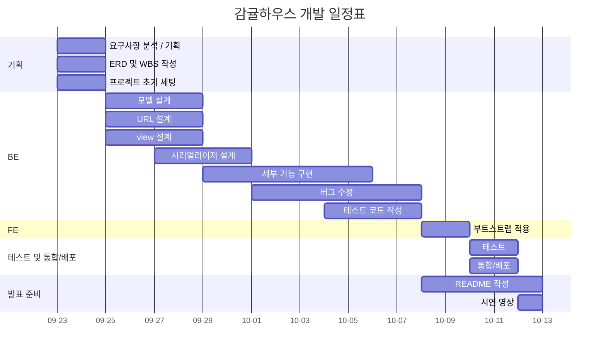
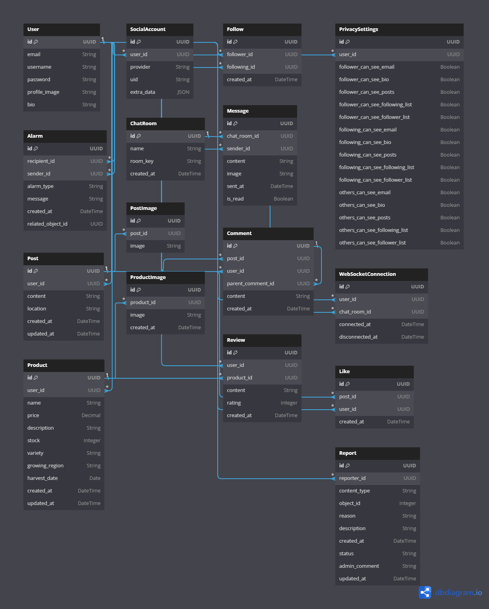

# 🍊 감귤하우스 


<br>

- 프로젝트 명 : Gamgyul House
- 프로젝트 진행 기간 : 24.09.20 ~ 24.10.13

<br>

감귤하우스는 상품(감귤)을 홍보하고 거래할 수 있는 SNS 플랫폼입니다. 
상품을 등록하지 않아도 일상을 공유하며 즐거운 SNS 활동을 할 수 있습니다. 
사진과 함께 게시물을 작성하여 자신의 일상을 공유할 수 있습니다. 다른 사용자를 팔로우하면 유저가 올린 게시물을 홈 피드에서 확인할 수 있습니다. 다른 사용자와 메시지를 주고 받을 수도 있습니다. 피드를 구경하다가 마음에 드는 게시물을 발견했다면 좋아요와 댓글을 남길 수 있습니다.

<br>

## 🏡 1. 팀 소개

| 이름   | 사진  | 깃허브 주소               | 담당 파트            |
|--------|-------|----------------------------|----------------------|
| 김동규  |  | [@Donggyu-Kim](https://github.com/Donggyu-Kim1) | accounts, report           |
| 이원재  |  | [@lwz7](https://github.com/lwj0712) | chat, alarm           |
| 문지영  |  | [@JiyoungMoon](https://github.com/whaehofk521) | insta           |
| 박성재  |  | [@HwangDal85](https://github.com/HwangDal85) | market           |

<br>

## 2. 개발 목표

저희 감귤하우스 팀은 현대적이고 확장 가능한 SNS 및 사용자 간 직거래 플랫폼을 개발하는 것을 목표로 하고 있습니다. 주요 개발 목표는 다음과 같습니다.

<br>

1. **Django Rest Framework(DRF)** 를 활용한 RESTful API 구현
   - 효율적이고 확장 가능한 백엔드 설계
   - API 버전 관리 및 문서화

2. **WebSocket** 을 이용한 실시간 통신 구현
   - 채팅 기능 및 실시간 알림 시스템 개발
   - 효율적인 서버-클라이언트 통신 구조 설계

3. **JWT(JSON Web Token)** 를 이용한 사용자 인증 시스템 구축
   - 안전하고 확장 가능한 사용자 인증 메커니즘 개발
   - 토큰 기반 인증과 세션 기반 인증의 장단점 이해

4. **Class-Based Views(CBV)** 를 통한 CRUD 기능 구현
   - 재사용 가능하고 유지보수가 용이한 view 로직 설계
   - DRF의 generic views 활용 숙달

5. **팀 협업 경험 축적**
   - Git을 활용한 버전, 브랜치 관리 및 협업 워크플로우 확립
   - 팀원끼리 부담없이 물어보고 도와주는 협업 문화 형성

6. **AWS** 를 통한 클라우드 배포
   - 클라우드 인프라 구축 및 관리 경험 습득
   - CI/CD 파이프라인 구축을 통한 자동화된 배포 프로세스 확립

7. **Docker** 를 활용한 일관된 개발 및 운영 환경 구축
   - 컨테이너화된 애플리케이션 개발 및 배포 프로세스 학습

8. **Redis** 를 통한 효율적인 메모리 관리 및 실시간 기능 구현
   - 실시간 데이터 처리 최적화
   - 채팅 기능을 위한 메시지 브로커로 Redis 활용
   - 사용자 접속 상태 관리 및 실시간 알림 기능 구현
  
9. **Daphne**를 활용한 ASGI 서버 구현
   - Django Channels와 Daphne를 이용한 WebSocket 연결 관리
   - 비동기 처리를 통한 고성능 실시간 통신 구현

10. 확장 가능한 **데이터베이스** 설계
   - 복잡한 관계를 가진 데이터 모델 설계 및 구현

<br>

이 프로젝트를 통해 저희 팀은 현대적인 웹 개발 기술 스택을 종합적으로 활용하며, 실무에서 발생할 수 있는 다양한 기술적 도전과제를 해결하는 경험을 쌓을 것입니다. 이를 통해 팀원 각자의 기술적 역량을 향상시키는 동시에, 효과적인 의사소통, 작업 분배, 코드 리뷰 등 개발 과정에서 발생하는 팀원 간의 상호작용을 원활히 관리하고 조율하는 능력도 함께 키우고자 합니다.

<br>

## 3. 기술 스택 및 아키텍처

### 3.1 기술 스택
<div align=left>
   
  <br>
  
   
   
   
  <br>
  
   
  
  <br>

  
  
  
  <br>

   
   
  <br>
  
  
  
</div>

<br>

### 3.2 아키텍처

<br>

## 4. 개발 환경 및 배포 URL

### 4.1 개발 환경

- Tools:

    
    

- Web Framework:

    
    
    

- 배포 환경:

    

- 협업 툴:

    
    
    
    

### 4.2 배포 URL

- URL:
- 테스트용 계정

```markdown
[일반 유저]
email: test@example.com
pw: xptmxmdbwj123

[관리자 유저]
id: admin
pw: 1234
```

<br>

## 5. API 문서 및 URL 구조

### 5.1 API 문서

- Swagger URL : http://localhost:8000/api/schema/swagger-ui/
- Redoc URl : http://localhost:8000/api/schema/redoc/

### 5.2 URL 구조

<details>
    <summary><h4>🔑 accounts</h4></summary>

| app: accounts | HTTP Method | 설명 | 로그인 권한 필요 | 작성자 권한 필요 | 추가 권한 |
| :-- | --- | --- | :-: | :-: | --- |
| signup/ | POST | 회원가입 |  |  |  |
| login/ | POST | 로그인 |  |  |  |
| logout/ | POST | 로그아웃 | ✅ |  |  |
| change-password/ | PUT | 비밀번호 변경 | ✅ | ✅ |  |
| deactivate/ | POST | 계정 비활성화 | ✅ | ✅ |  |
| delete/ | POST | 계정 삭제 | ✅ | ✅ |  |
| request-reactivation/ | POST | 계정 재활성화 요청 |  |  |  |
| activate/\<uidb64\>/\<token\>/ | GET | 계정 활성화 |  |  | 유효한 토큰 |
| profile/\<str:username\>/ | GET | 유저 프로필 조회 | ✅ |  |  |
| profile/ | PUT, PATCH | 유저 프로필 수정 | ✅ | ✅ |  |
| privacy-settings/ | GET, PUT, PATCH | 개인정보 설정 조회 | ✅ | ✅ |  |
| follow/\<int:pk\>/ | POST | 사용자 팔로우 | ✅ |  |  |
| unfollow/\<int:pk\>/ | DELETE | 사용자 언팔로우 | ✅ |  |  |
| search/ | GET | 유저 프로필 검색 | ✅ |  |  |
| recommend/ | GET | 친구 추천 | ✅ |  |  |

</details>

<details>
    <summary><h4>📢 alarm</h4></summary>

| app: alarm | HTTP Method | 설명 | 로그인 권한 필요 | 작성자 권한 필요 | 추가 권한 |
| :-- | --- | --- | :-: | :-: | --- |
| alarms/ | GET | 현재 로그인한 사용자의 알림 목록 조회 | ✅ |  |  |
| alarms/\<int:alarm_id\>/ | DELETE | 특정 알림 삭제 | ✅ |  | 해당 알림의 수신자여야 함 |
| alarms/bulk-delete/ | DELETE | 모든 알림 삭제 | ✅ |  | 해당 알림의 수신자여야 함 |

</details>

<details>
    <summary><h4>🤝 chat</h4></summary>

| app: chat | HTTP Method | 설명 | 로그인 권한 필요 | 작성자 권한 필요 | 추가 권한 |
| :-- | --- | --- | :-: | :-: | --- |
| / | GET | 현재 사용자가 속한 채팅방 목록 조회 | ✅ |  |  |
| /create/ | POST | 1대1 채팅방 생성 | ✅ |  |  |
| /\<uuid:room_id\>/ | GET | 특정 채팅방 정보 조회 | ✅ |  | 해당 채팅방 참여자여야 함 |
| /\<uuid:room_id\>/leave/ | DELETE | 채팅방 나가기 | ✅ |  | 해당 채팅방 참여자여야 함 |
| /\<uuid:room_id\>/messages/ | GET | 채팅방 내 메시지 목록 조회 | ✅ |  | 해당 채팅방 참여자여야 함 |
| /\<uuid:room_id\>/messages/send/ | POST | 메시지 생성 | ✅ |  | 해당 채팅방 참여자여야 함 |
| /\<uuid:room_id\>/messages/search/ | GET | 메시지 검색 | ✅ |  | 해당 채팅방 참여자여야 함 |

</details>

<details>
    <summary><h4>📷 insta</h4></summary>

| app: insta | HTTP Method | 설명 | 로그인 권한 필요 | 작성자 권한 필요 | 추가 권한 |
| :-- | --- | --- | :-: | :-: | --- |
| /posts/ | GET | 게시글 목록 조회 |  |  |  |
| /posts/\<int:pk\>/ | GET | 게시글 상세 조회 |  |  |  |
| /posts/create/ | POST | 게시글 작성 | ✅ |  |  |
| /posts/\<int:pk\>/delete/ | DELETE | 게시글 삭제 | ✅ | ✅ |  |
| /posts/\<int:post_id\>/comments/ | GET, POST | 게시글에 댓글 목록 조회 및 댓글 작성 | ✅ |  |  |
| /comments/\<int:pk\>/ | GET | 댓글 상세 조회 | ✅ |  |  |
| /posts/\<int:post_id\>/like/ | POST | 게시글 좋아요 | ✅ |  |  |
| /posts/search/ | GET | 태그로 게시글 검색 |  |  |  |

</details>

<details>
    <summary><h4>🛒 products</h4></summary>

| app: products | HTTP Method | 설명 | 로그인 권한 필요 | 작성자 권한 필요 | 추가 권한 |
| :-- | --- | --- | :-: | :-: | --- |
| /products/ | GET | 상품 목록 조회 |  |  |  |
| /products/create/ | POST | 상품 생성 | ✅ |  |  |
| /products/\<int:id\>/ | GET | 상품 상세 조회 |  |  |  |
| /products/\<int:id\>/update/ | PATCH | 상품 정보 수정 | ✅ | ✅ |  |
| /products/\<int:id\>/delete/ | DELETE | 상품 삭제 | ✅ | ✅ |  |
| /products/\<int:product_id\>/reviews/\<int:id\>/delete/ | DELETE | 상품 리뷰 삭제 | ✅ | ✅ |  |

</details>

<details>
    <summary><h4>🚨 report</h4></summary>

| app: report | HTTP Method | 설명 | 로그인 권한 필요 | 작성자 권한 필요 | 추가 권한 |
| :-- | --- | --- | :-: | :-: | --- |
| /create/ | POST | 신고 생성 | ✅ |  |  |

</details>

<br>

## 6. 프로젝트 구조와 개발 일정

### 6.1 프로젝트 구조

<details>
    <summary><h4>BE</h4></summary>

```
📦BE
 ┣ 📂accounts
 ┃ ┣ 📂migrations
 ┃ ┣ 📂tests
 ┃ ┃ ┣ 📜test_views_account.py
 ┃ ┃ ┣ 📜test_views_profile.py
 ┃ ┃ ┗ 📜test_views_recommendation.py
 ┃ ┣ 📂views
 ┃ ┃ ┣ 📜__init__.py
 ┃ ┃ ┣ 📜account.py
 ┃ ┃ ┣ 📜profile.py
 ┃ ┃ ┗ 📜recommendation.py 
 ┃ ┣ 📜__init__.py
 ┃ ┣ 📜admin.py
 ┃ ┣ 📜apps.py
 ┃ ┣ 📜auth_backends.py
 ┃ ┣ 📜filters.py
 ┃ ┣ 📜models.py
 ┃ ┣ 📜serializers.py
 ┃ ┗ 📜urls.py
 ┣ 📂alarm
 ┃ ┣ 📂migrations
 ┃ ┣ 📜__init__.py
 ┃ ┣ 📜admin.py
 ┃ ┣ 📜apps.py
 ┃ ┣ 📜comsumers.py
 ┃ ┣ 📜models.py
 ┃ ┣ 📜serializers.py
 ┃ ┣ 📜signals.py
 ┃ ┣ 📜tests.py
 ┃ ┣ 📜urls.py
 ┃ ┣ 📜views.py
 ┣ 📂chat
 ┃ ┣ 📂migrations
 ┃ ┣ 📜__init__.py
 ┃ ┣ 📜admin.py
 ┃ ┣ 📜apps.py
 ┃ ┣ 📜comsumers.py
 ┃ ┣ 📜models.py
 ┃ ┣ 📜routing.py
 ┃ ┣ 📜serializers.py
 ┃ ┣ 📜tests.py
 ┃ ┣ 📜urls.py
 ┃ ┣ 📜views.py
 ┣ 📂config
 ┃ ┣ 📜__init__.py
 ┃ ┣ 📜asgi.py
 ┃ ┣ 📜pagination.py
 ┃ ┣ 📜settings.py
 ┃ ┣ 📜urls.py
 ┃ ┗ 📜wsgi.py
 ┣ 📂insta
 ┃ ┣ 📂migrations
 ┃ ┣ 📜__init__.py
 ┃ ┣ 📜admin.py
 ┃ ┣ 📜apps.py
 ┃ ┣ 📜filters.py
 ┃ ┣ 📜models.py
 ┃ ┣ 📜serializers.py
 ┃ ┣ 📜tests.py
 ┃ ┣ 📜urls.py
 ┃ ┗ 📜views.py
 ┣ 📂market
 ┃ ┣ 📂migrations
 ┃ ┣ 📜__init__.py
 ┃ ┣ 📜admin.py
 ┃ ┣ 📜apps.py
 ┃ ┣ 📜models.py
 ┃ ┣ 📜serializers.py
 ┃ ┣ 📜tests.py
 ┃ ┣ 📜urls.py
 ┃ ┗ 📜views.py
 ┣ 📂report
 ┃ ┣ 📂migrations
 ┃ ┣ 📜__init__.py
 ┃ ┣ 📜admin.py
 ┃ ┣ 📜apps.py
 ┃ ┣ 📜models.py
 ┃ ┣ 📜serializers.py
 ┃ ┣ 📜tests.py
 ┃ ┣ 📜urls.py
 ┃ ┗ 📜views.py
 ┣ 📜.gitignore
 ┣ 📜README.md
 ┣ 📜docker-compose.yml
 ┣ 📜manage.py
 ┗ 📜requirements.txt
```
</details>

<details>
    <summary><h4>FE</h4></summary>

```

```
</details>

<br>

### 6.2 개발 일정



<br>

## 7. ERD


<h4>관계도 해설</h4>

1. 사용자 관리:
    - User 테이블이 중심이 되어 사용자의 기본 정보를 저장합니다.
    - SocialAccount 테이블은 소셜 로그인 기능을 지원합니다.
    - PrivacySettings 테이블로 사용자의 개인정보 공개 설정을 관리합니다.
    - Follow 테이블로 사용자 간의 팔로우 관계를 표현합니다.

2. SNS 기능:
    - Post, Comment, Like 테이블들로 게시물, 댓글, 좋아요 기능을 구현합니다.
    - PostImage 테이블은 게시물에 여러 이미지를 첨부할 수 있게 합니다.

3. 메시지 시스템:
    - ChatRoom, Message 테이블은 사용자 간 채팅 기능을 제공합니다.
    - WebSocketConnection 테이블은 실시간 통신을 관리합니다.
        - 현재 사용자가 채팅방에 연결되어 있는지를 확인할 수 있습니다.
        - 채팅방에 연결되어 있는 상태라면 새로운 메시지를 읽음 처리합니다.
        - 채팅방에 연결되어 있는 상태라면 메시지 알림을 보내지 않습니다.

4. 알림 시스템:
    - 새로운 메시지에 대한 알림을 생성합니다.
    - 다른 사용자가 나를 팔로우 했을 때 알림
    - 내 게시물에 댓글이 달렸을 때 알림
    - 내 게시물에 좋아요가 달렸을 때 알림

5. Market 기능:
    - Product 테이블은 판매 상품 정보를 저장합니다.
    - ProductImage 테이블로 상품 이미지를 관리합니다.
    - Review 테이블은 상품에 대한 리뷰를 저장합니다.

6. 신고 시스템:
    - Report 테이블로 부적절한 컨텐츠 신고를 관리합니다.

7. 이미지 파일 관리:
    - PostImage와 ProductImage를 분리함으로써, SNS 기능과 Market 기능 각각의 요구사항에 최적화된 방식으로 이미지를 관리합니다.

주요 관계:
- 사용자(User)는 여러 게시물(Post), 댓글(Comment), 좋아요(Like), 상품(Product), 리뷰(Review)를 가질 수 있습니다.
- 게시물(Post)은 여러 이미지(PostImage), 댓글(Comment), 좋아요(Like)를 가질 수 있습니다.
- 상품(Product)은 여러 이미지(ProductImage)와 리뷰(Review)를 가질 수 있습니다.
- 사용자들은 서로 팔로우할 수 있고(Follow), 채팅방(ChatRoom)에 참여하여 메시지(Message)를 주고받을 수 있습니다.

<br>

## 8. 시연 영상

<br>

## 9. 트러블 슈팅

<br>

## 10. 🤙 컨벤션

프로젝트의 일관성 유지와 협업 효율성을 높이기 위해 아래 컨벤션을 따릅니다.
 
<details>
    <summary><h4>📌 Git 컨벤션</h4></summary>
  

## 커밋 메시지 구조
커밋 메시지는 크게 두 부분으로 구성됩니다.

```
<이모지> <타입>: <제목>

<본문>
```

### 타입
| 이모지 | 커밋 메세지 | 타입 | 설명 |
|:---:|:---:|:---:|:---|
| ✨ | `:sparkles:` | feat: | 새로운 기능 추가 |
| 🐛 | `:bug:` | fix: | 버그 수정 |
| 📝 | `:memo:` | docs: | 문서 작업 |
| 🎨 | `:art:` | style: | 코드 포맷팅, 세미콜론 누락, 코드 변경이 없는 경우 |
| ♻️ | `:recycle:` | refactor: | 코드 리팩토링 |
| 🧪 | `:test_tube:` | test: | 테스트 |
| 🚀 | `:rocket:` | deploy: | 배포 |
| 🔧 | `:wrench:` | conf: | 빌드, 환경 설정 |
| ✏ | `:pencil2:` | chore: | 기타 작업 |
| 🔀 | `:twisted_rightwards_arrows:` | merge: | 브랜치 병합 |
| 🗃️ | `:card_file_box:` | db: | 데이터베이스 관련 변경 |


### 제목 규칙
- 50자 이내로 작성
- 마침표 사용하지 않음
- 현재 시제 사용
- 명령문으로 작성

### 본문 규칙(선택 사항)
- 72자 단위로 줄 바꿈
- 어떻게 보다는 무엇을, 왜에 대해 설명
- 제목과 본문 사이에 빈 줄 추가

## 브랜치 전략

### 메인 브랜치
main: 프로젝트의 메인 브랜치

### 보조 브랜치
feature/<기능명>: 새로운 기능 개발을 위한 브랜치

### 병합 전략
- Pull Request(PR)를 사용하여 코드 리뷰를 진행
- 최소 1명 이상의 리뷰어의 승인을 받아야 병합할 수 있음
- 병합하기 전에 충돌을 해결

## 기타 규칙
- .gitignore 파일을 적극적으로 활용하여 불필요한 파일이 저장소에 포함되지 않도록 하기
</details>

<details>
    <summary><h4>📌 Code 컨벤션</h4></summary>
  
## 일반 규칙

- PEP 8 규칙을 준수합니다.
- Black formatter를 사용하여 코드 포맷팅을 일관성 있게 유지합니다.
- import 문은 다음 순서로 그룹화합니다:
    1. 표준 라이브러리
    2. 서드파티 라이브러리
    3. 로컬 애플리케이션/라이브러리


## Models 코드 컨벤션

- 모델 클래스는 단수형 명사로 명명합니다.
- 필드 이름은 소문자 스네이크 케이스를 사용합니다.
- 관계 필드는 관련 모델의 이름을 사용합니다.
- Meta 클래스는 필드 정의 다음에 위치시킵니다.
- 커스텀 메서드는 Meta 클래스 다음에 위치시킵니다.
- 주석은 독스트링으로 작성합니다.

예시:
```
from django.db import models
from django.contrib.auth.models import User

class Article(models.Model):
    """
    ariticle 클래스
    """

    title = models.CharField(max_length=100)
    content = models.TextField()
    created_at = models.DateTimeField(auto_now_add=True)
    updated_at = models.DateTimeField(auto_now=True)
    author = models.ForeignKey(User, on_delete=models.CASCADE, related_name='articles')

    class Meta:
        ordering = ['-created_at']
        verbose_name = 'Article'
        verbose_name_plural = 'Articles'

    def __str__(self):
        return self.title

    def get_absolute_url(self):
        return reverse('article-detail', kwargs={'pk': self.pk})
```

## Serializer 코드 컨벤션

- Serializer 클래스 이름은 관련 모델 이름 뒤에 'Serializer'를 붙입니다.
- Meta 클래스는 필드 정의 바로 다음에 위치시킵니다.
- fields 속성에서 필드를 명시적으로 나열합니다. __all__의 사용은 지양합니다.
- 중첩된 serializer는 명시적으로 정의합니다.
- 유효성 검사 메서드는 validate_<field_name> 형식으로 명명합니다.
- 주석은 독스트링으로 작성합니다.

예시:
```
from rest_framework import serializers
from .models import Article

class ArticleSerializer(serializers.ModelSerializer):
    author = serializers.ReadOnlyField(source='author.username')
    
    class Meta:
        model = Article
        fields = ['id', 'title', 'content', 'author', 'created_at', 'updated_at']
    
    def validate_title(self, value):
        if len(value) < 5:
            raise serializers.ValidationError("Title must be at least 5 characters long.")
        return value
```

## Views 코드 컨벤션

- 클래스 기반 뷰를 사용합니다.
- 뷰 클래스 이름은 동작을 설명하는 동사로 시작하고 'View'로 끝납니다.
- 주석은 독스트링으로 작성합니다.


예시:
```
from rest_framework import viewsets, permissions
from .models import Article
from .serializers import ArticleSerializer

class ListCreateArticleView(viewsets.ModelViewSet):
    queryset = Article.objects.all().select_related('author')
    serializer_class = ArticleSerializer
    permission_classes = [permissions.IsAuthenticatedOrReadOnly]

    def perform_create(self, serializer):
        serializer.save(author=self.request.user)

    @action(detail=True, methods=['post'])
    def publish(self, request, pk=None):
        article = self.get_object()
        article.publish()
        return Response({'status': 'article published'})
```

## URLs 코드 컨벤션

- URL 패턴은 명확하고 RESTful한 구조를 따릅니다.
- URL 이름은 앱 이름을 접두사로 사용합니다.

예시:
```
from django.urls import path, include
from rest_framework.routers import DefaultRouter
from .views import ListCreateArticleView

router = DefaultRouter()
router.register(r'articles', ListCreateArticleView)

urlpatterns = [
    path('api/v1/', include(router.urls)),
    path('api/v1/articles/<int:pk>/publish/', 
         ListCreateArticleView.as_view({'post': 'publish'}), 
         name='article-publish'),
]
```

## 코드 리뷰

1. 기능 구현이 완료되면 push 하고 pr 요청
2. pr 메세지에는 어떤 기능을 구현했는지 작성
3. pr 요청을 보내고 다음 날 9시 전까지 comment 생성
4. pr 요청을 보낸 사람은 9시에 답변 생성
5. 답변 생성이 끝나면 팀원들에게 알리고 시간을 정해 답변 읽기
6. 피드백 후 merge
</details>

<br>

## 11. 프로젝트를 마치며

김동규
> Lorem ipsum dolor sit amet, consectetur adipiscing elit, sed do eiusmod tempor incididunt ut labore et dolore magna aliqua. Ut enim ad minim veniam, quis nostrud exercitation ullamco laboris nisi ut aliquip ex ea commodo consequat. Duis aute irure dolor in reprehenderit in voluptate velit esse cillum dolore eu fugiat nulla pariatur. Excepteur sint occaecat cupidatat non proident, sunt in culpa qui officia deserunt mollit anim id est laborum.

이원재
> Lorem ipsum dolor sit amet, consectetur adipiscing elit, sed do eiusmod tempor incididunt ut labore et dolore magna aliqua. Ut enim ad minim veniam, quis nostrud exercitation ullamco laboris nisi ut aliquip ex ea commodo consequat. Duis aute irure dolor in reprehenderit in voluptate velit esse cillum dolore eu fugiat nulla pariatur. Excepteur sint occaecat cupidatat non proident, sunt in culpa qui officia deserunt mollit anim id est laborum.

문지영
> Lorem ipsum dolor sit amet, consectetur adipiscing elit, sed do eiusmod tempor incididunt ut labore et dolore magna aliqua. Ut enim ad minim veniam, quis nostrud exercitation ullamco laboris nisi ut aliquip ex ea commodo consequat. Duis aute irure dolor in reprehenderit in voluptate velit esse cillum dolore eu fugiat nulla pariatur. Excepteur sint occaecat cupidatat non proident, sunt in culpa qui officia deserunt mollit anim id est laborum.

박성재
> Lorem ipsum dolor sit amet, consectetur adipiscing elit, sed do eiusmod tempor incididunt ut labore et dolore magna aliqua. Ut enim ad minim veniam, quis nostrud exercitation ullamco laboris nisi ut aliquip ex ea commodo consequat. Duis aute irure dolor in reprehenderit in voluptate velit esse cillum dolore eu fugiat nulla pariatur. Excepteur sint occaecat cupidatat non proident, sunt in culpa qui officia deserunt mollit anim id est laborum.